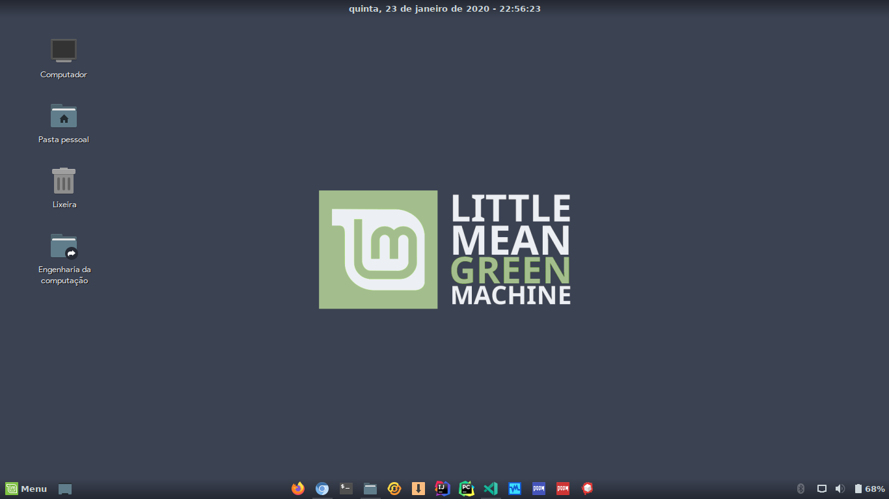
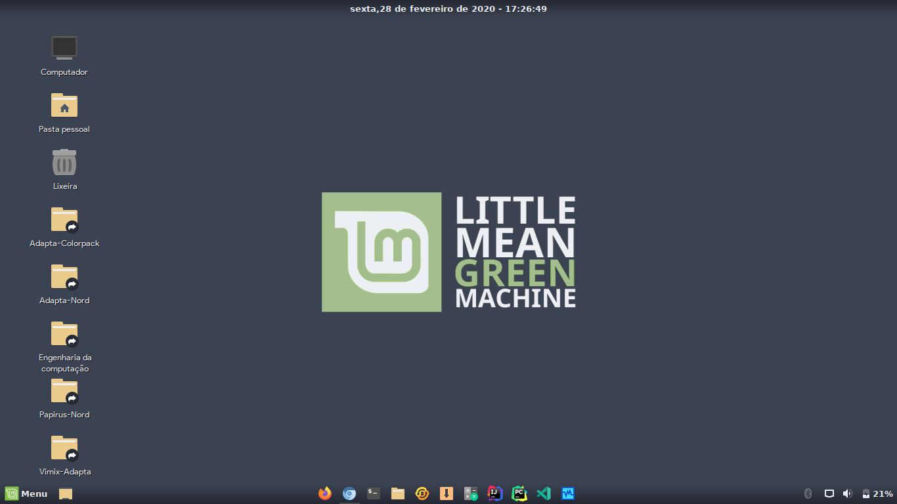
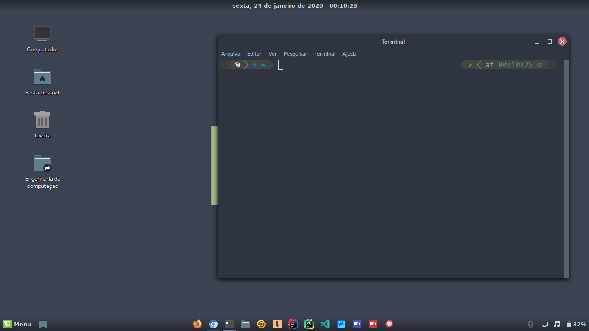
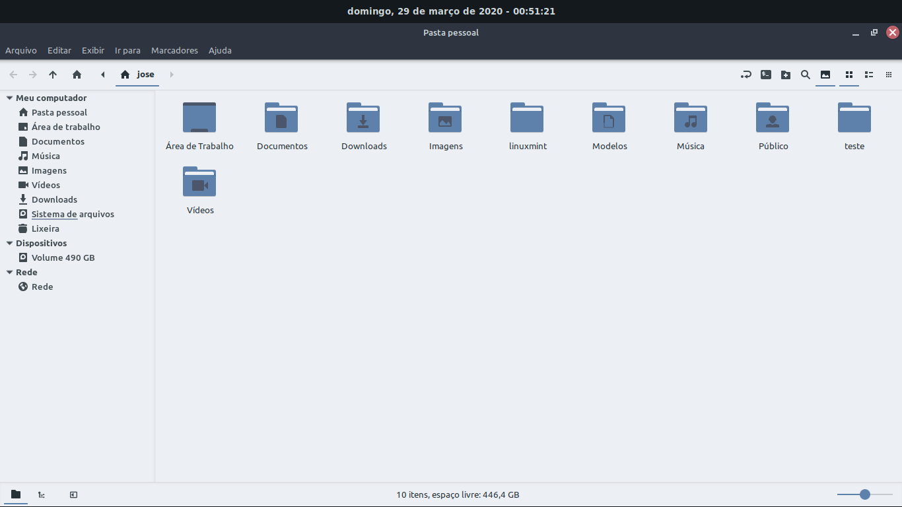

# Adapta-Nord

This theme is mod made from the Adapta Cyan made by me, still in beta! It may contain colors that have not been modified! There will also be nokto versions of this theme!

This theme's colors come from the Nord pallete made by <a href="https://github.com/arcticicestudio/nord">Arctic Ice Studio</a>!

The wallpaper of the image comes with the theme, and is in the Wallpapers folder in the theme folder!

For users that not use use metacity WM, use the original Adapta window buttons, it was not possible to harmonize with the design of the metacity window buttons on gtk-3.0 and gtk-3.22!

# Instalation

Put all files in /usr/share/themes (my preference) or in a folder of your own!

# Images

