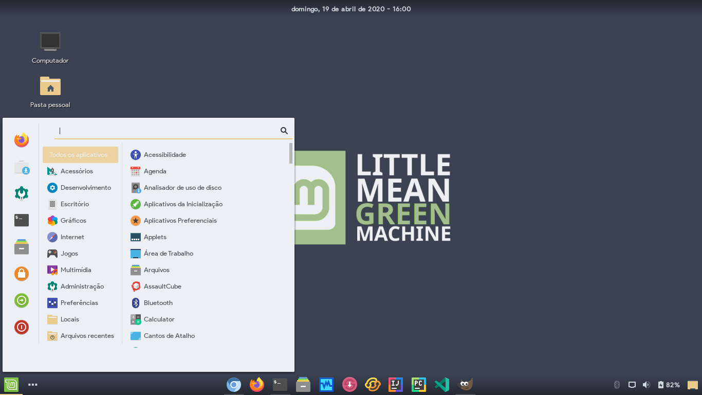
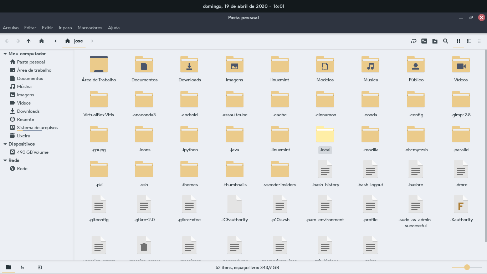

# Adapta-Nord

Nord version of <a href="https://github.com/Joshaby/Adapta-Colorpack">Adapta Theme</a>! This theme is a fork of Adapta Cyan modified by me!

Still in beta!

This theme's colors come from the Nord pallete made by <a href="https://github.com/arcticicestudio/nord">Arctic Ice Studio</a>!

## Available colors (in light and nokto versions)

 - Frost Blue

## Instalation

For Debian, Ubuntu or distribution based on them, use the deb file in <a href="https://github.com/Joshaby/Adapta-Nord/releases">Adapta Releases</a>, otherwise, run the Install.sh file!

## Images

## License

GNU GPL v2
