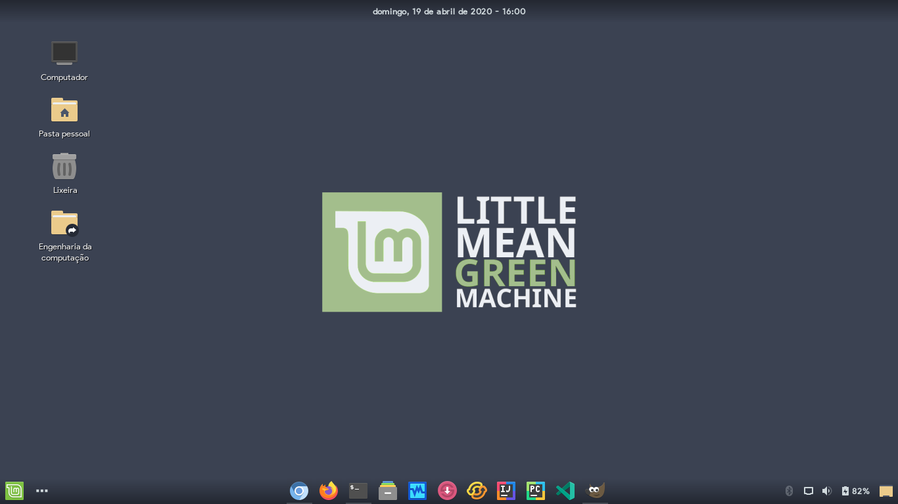

 Adapta Nord
=====

Nord version of <a href="https://github.com/Joshaby/Adapta-Colorpack">Adapta Colorpack</a>!

  
  
  
  

## Suported DEs
 - Xfce4
 - Cinnamon
 - Mate
 - Gnome
 - Budgie
 - LXDE

## Available colors (in light and nokto versions)

 - Frost Blue 4
 - Aurora Green
 - Aurora Yellow

## Instalation

For Debian, Ubuntu or distribution based on them, use the deb file in <a href="https://github.com/Joshaby/Adapta-Nord/releases">Adapta Releases</a>, otherwise, run the Install.sh file!

## Images

This theme's colors come from the Nord pallete made by <a href="https://github.com/arcticicestudio/nord">Arctic Ice Studio</a>!

## License

GNU GPL v2
